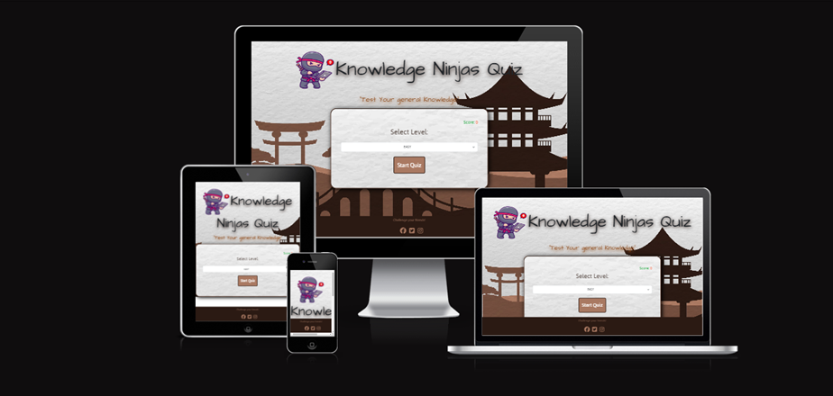
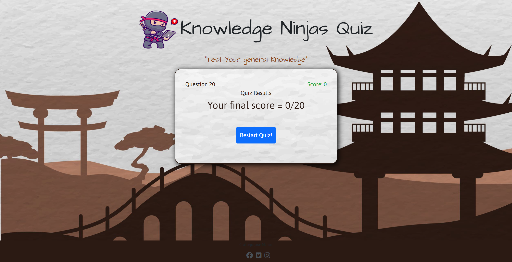

# 🎮 Knowledge Ninjas Quiz🎉

## Names of Contributors

Ciaran Brain,  
David Wiseman,
Manjula Lal,

Welcome to Knowledge-Ninja's online quiz game! 🧠

Whether you are a seasoned quizmaster or just a casual trivia enthusiasst,
get ready to come on a thrilling journey of knowledge, laughter and friendly competiontion.

This is part of Code Institutes 3-day hackathon! Where these hackathons are "non-competetive" and just fun, learning experiences 😉🏆

## Overview 🤓

External user’s goal:
- The site’s users want to play an online quiz to test general/specific knowledge such as 
sports/movies/literary knowledge or personality assessment.

Site owner's goal:
- The goal of the site is to provide a challenging quiz to entertain online users.

## Features 🚀

### 🎮 Interactive Quizzes 
The user has the option to pick from 3 levels, which are Easy, medium or hard! The questions displayed are a selection of questions generated through 3 API links. The user has the option to click between a possiblilty of 4 answers. Though the user can see throughout the questionnaire the questions that they are getting wrong, we have added and additional page at the end of the quic showing a results page, where the user has the option to also go back to the start of the quiz and pick another level.  

### 🏆 Score Tracker
The score is shown to the user throughout the quich and on the final page where the quiz has ended. 

### 🎨 Development Strategy and Wireframe 

 Initially the team started of using a Miro Board for ideation.

 We collectivly wrote down a plan of technologies we will be using and the theme. Throughout the project, if any of the team had initial ideas they would be place them on the miro board to consider. 

We had used Balsamic for our wireframe design. We were very happy with the layout and there was very little changes made in comparison to the end product.

![Balsamiq-Board2] (assets/readme/images/wire%20last.png)

We had used Git hub for our project board which we populated with our user stories and moved them to there rightful place where tasks were completed. We also labelled them using the MoSCow approach where we labelled each task there priority.

Stages before Final design

After each members skills were assesed, the project was divided on an individual basis. 
### Bugs Fixed and Unfixed

### Technology used
Miro-board
Github
VSCode
Java-script
Bootstrap
CSS
API

### Future Features and Modifications

Would like to have a different background for the levels. We have a sample that we wanted to use, which will be used in the next iteration. 

[Future-iteration1](assets/readme/images/background-image-FI1.png)
[Future-iteration2](assets/readme/images/bg-img-f2.png)

We would also like to have a 20 second timer for the user per question and a reset button on each page so the user can go to the start of the qui at any time.

Also we would like the opportunity fot the user to have the option to see the answer before making the choice on which one to pick.

### Credits

First and foremost, we would like to thank David Calikes, Martin, Kevin and Miklos at the code institute for the support and the knowledge they have provided us to complete this project.

https://opentdb.com/api_config.php - Quiz API's

Sites used to enhance understanding of the project
https://www.youtube.com/watch?v=-cX5jnQgqSM&t=11s
https://www.youtube.com/watch?v=PBcqGxrr9g8&t=1030s 
https://www.udemy.com/course/build-a-quiz-app-with-html-css-and-javascript/learn/lecture/13703650#overview
https://www.youtube.com/@WebDevSimplified
